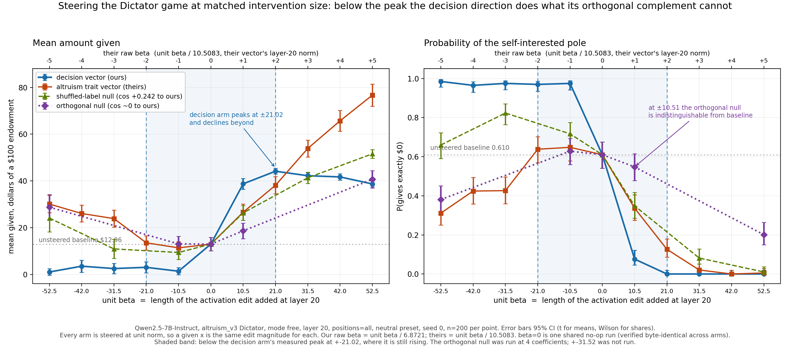

# An outcome-defined steering vector for the Dictator game

A steering direction built from **what the model did** in a one-shot anonymous
Dictator game, not from a description of a personality trait — then added to the
residual stream to see whether it changes what the model does next.

The reference method in this repo (Chen et al., `generate_vec.py`) builds a trait
direction by writing two system prompts — one telling the model to be altruistic,
one telling it the opposite — running both over everyday advice questions, and
taking the difference of mean activations. The label is the experimenter's
instruction, and the extraction prompts are off-distribution from the games the
vector is later steered on.

The vector here inverts both choices. Labels come from the amount the model
actually transferred, scored by a deterministic parser; activations are captured on
the game prompts themselves. Nothing in its construction references a trait word, a
persona instruction, or an LLM judge.

`METHOD.md` in this directory is the full construction — the prompt grid, the pole
definitions, cell-balancing, both nulls, and the gates. This file is the result.

Everything below is `Qwen/Qwen2.5-7B-Instruct` at revision
`a09a35458c702b33eeacc393d103063234e8bc28`, bfloat16, `sdpa`, layer 20,
`altruism_v3` Dictator with a $100 endowment, mode `free`, seed 0, n = 200 per
coefficient.

---

## What was compared

Four steering arms on the same game, the same pipeline, the same seed, and one
shared unsteered run:

| arm | what it is |
|---|---|
| **decision** | the outcome-defined vector, `vectors/decision_response_avg_diff_cellbalanced.pt` |
| **trait vector** | the repo's shipped `persona_vectors/Qwen2.5-7B-Instruct/altruism_response_avg_diff.pt` |
| **shuffled-label null** | the decision vector rebuilt with the pole labels permuted within each cell |
| **orthogonal null** | the shuffled-label null with the decision direction projected out |

Raw coefficients are not comparable across vectors of different length. The
layer-20 norms are 6.8721 (decision), 10.5083 (trait), 0.5799 (shuffled null) and
0.5626 (orthogonal null). Every arm is therefore steered at **unit norm**, and the
x-axis below is **unit beta** — the length of the activation edit added at layer
20. A given unit beta is the same size of intervention for every arm. Unit beta
`k x 10.5083` reproduces exactly the edit the trait vector's raw beta `k` produced,
so the trait vector's existing sweep drops onto the same axis without being re-run.

`beta = 0` is one shared no-op run: the delta is exactly zero for every vector, and
the decision arm's 200 `beta = 0` answers were checked byte-identical to the
reference sweep's. The curves share an origin by construction.

## The comparison

Mean dollars given of a $100 endowment, with 95% t-intervals. Means are over
parsed rows only; an answer the scorer cannot resolve keeps its row and its tag and
is never counted as a zero. Per-point `n`, `parsed`, SD and SE are in `summary.csv`.

| unit beta | their raw beta | decision (ours) | trait vector (theirs) | shuffled-label null | orthogonal null |
|---|---|---|---|---|---|
| -52.54 | -5 | $1.03 [-0.39, 2.45] | $30.11 [26.42, 33.80] | $24.10 [18.18, 30.03] | $28.76 [23.32, 34.20] |
| -42.03 | -4 | $3.52 [0.94, 6.10] | $26.06 [22.44, 29.68] | *not run* | *not run* |
| -31.52 | -3 | $2.51 [0.32, 4.71] | $23.87 [20.19, 27.55] | $10.90 [6.80, 15.01] | *not run* |
| -21.02 | -2 | $3.03 [0.62, 5.44] | $13.52 [10.48, 16.56] | *not run* | *not run* |
| -10.51 | -1 | $1.37 [-0.13, 2.87] | $11.37 [8.64, 14.09] | $9.38 [6.42, 12.34] | $13.06 [9.83, 16.28] |
| 0 | 0 | $12.96 [10.09, 15.84] | $12.96 [10.09, 15.84] | $12.96 [10.09, 15.84] | (shared) |
| +10.51 | +1 | $38.75 [36.44, 41.06] | $26.62 [23.15, 30.09] | $26.32 [23.16, 29.48] | $18.64 [15.33, 21.94] |
| +21.02 | +2 | $44.14 [42.92, 45.37] | $38.14 [34.50, 41.77] | *not run* | *not run* |
| +31.52 | +3 | $42.22 [40.99, 43.46] | $53.89 [50.28, 57.49] | $41.34 [38.95, 43.73] | *not run* |
| +42.03 | +4 | $41.71 [40.39, 43.02] | $65.71 [61.23, 70.20] | *not run* | *not run* |
| +52.54 | +5 | $38.70 [37.45, 39.95] | $76.68 [71.95, 81.41] | $51.58 [49.74, 53.42] | $40.69 [37.01, 44.36] |



**The two curves have different shapes.** Movement from the shared $12.96 baseline
on the positive arm:

| unit beta | decision | trait vector | shuffled null | orthogonal null |
|---|---|---|---|---|
| +10.51 | +25.78 | +13.66 | +13.36 | +5.67 |
| +21.02 | +31.18 | +25.17 | — | — |
| +31.52 | +29.26 | +40.92 | +28.37 | — |
| +42.03 | +28.74 | +52.75 | — | — |
| +52.54 | +25.73 | +63.71 | +38.61 | +27.72 |

The decision vector reaches essentially its full effect at the smallest step tested
and then declines slightly but significantly (+52.54 against +21.02:
-5.44 [-7.19, -3.70], p = 2.2e-09). The trait vector has delivered 21% of its
eventual move at that same point and is still climbing at the end of the range.

They also move mass to different places. The decision vector empties the $0 mode
completely and parks the model just below half — at +52.54, 69.4% of parsed answers
fall in [$25, $50), 30.1% land on exactly $50, and **none** reach $100. The trait
vector climbs the 0 -> 50 -> 100 ladder and puts 63.2% of its mass on $100 at the
same coefficient.

The decision vector is also the **only** direction tested that moves giving *down*.
The trait vector, both nulls, and the trait vector's own published behaviour all
raise giving under negative steering.

## The result

**Does the decision vector move decisions? Yes.** It drives `P(gives exactly $0)`
from a baseline of 0.610 to 0.000 in one direction and to 0.985 in the other, at
n = 200 per point with non-overlapping intervals.

**Is the decision separation the mechanism?** This is the question the orthogonal
null exists to answer, and the answer has two halves. Both are load-bearing.

**Below saturation, yes.** At unit beta ±10.51 — where the decision arm is still
responding — an exactly-orthogonal direction of the same length does not reproduce
the effect. On `P(gives exactly $0)`, the contrast the vector was actually built
from, differences from the shared baseline of 0.610 with Newcombe intervals:

| unit beta | decision | vs baseline | orthogonal null | vs baseline |
|---|---|---|---|---|
| -52.54 | 0.985 | +0.375 [+0.304, +0.444] | 0.381 | -0.229 [-0.321, -0.131] |
| **-10.51** | **0.975** | **+0.365 [+0.292, +0.435]** | **0.628** | **+0.018 [-0.077, +0.112]** |
| **+10.51** | **0.076** | **-0.534 [-0.605, -0.451]** | **0.548** | **-0.062 [-0.157, +0.034]** |
| +52.54 | 0.000 | -0.610 [-0.675, -0.538] | 0.201 | -0.409 [-0.491, -0.316] |

At ±10.51 the orthogonal null's interval contains zero **in both directions**. A
same-length edit sharing none of the decision direction is indistinguishable from
doing nothing on the pole metric, while the decision direction moves the pole by
+0.365 and -0.534.

On mean dollars the same picture holds, with one qualification that has to be
stated rather than rounded away:

| unit beta | orthogonal null, movement from baseline | 95% CI | p |
|---|---|---|---|
| **-10.51** | **+0.09** | **[-4.21, +4.40]** | **0.97** |
| **+10.51** | **+5.67** | **[+1.31, +10.04]** | **0.011** |

On the negative side the orthogonal null does **nothing at all** — $13.06 against a
baseline of $12.96, while the decision vector drops to $1.37. On the positive side
it is not flat: it produces a small but real move of +5.67, **about a fifth** of the
decision vector's +25.78. So the precise claim is: the orthogonal null is flat on
the negative side and flat on both sides of the pole metric, but delivers roughly a
fifth of our effect on the positive-side dollar mean.

**Above saturation, no — and the question is ill-posed there.** At +52.54 the
orthogonal null's mean is statistically indistinguishable from the decision arm's
(difference +1.99 [-1.89, +5.87], p = 0.31). Read alone that says the decision
separation is not the mechanism. It does not say that. Both arms are past the point
where this game can separate them, and the two arms are not doing the same thing to
get there: the orthogonal null arrives at that mean with 20.1% of answers still at
$0, an SD of 25.61 against the decision arm's 8.65, and the worst surface
degeneracy anywhere in the run (40% of its answers contain a word trigram repeated
five or more times, against 1% for the decision arm at the same coefficient). The
means agree; the behaviour does not.

Any sufficiently large edit at layer 20 disrupts behaviour regardless of what it
encodes. **The comparison at the edge of the range measures saturation, not
mechanism.**

## Why the controls are shaped the way they are

This is the most transferable part of the run, and it cost two reversals to learn.

**A permutation null is null with respect to labels, not orthogonal to the target.**
The obvious control is to rebuild the vector from the same activations with the pole
labels permuted. That is a genuine control, and it is not the one most people think
they are running. Permuting labels destroys the *label association*; it does not
produce a direction unrelated to the real one, because both are built from the same
rows.

Measured here, the shuffled-label null's cosine to the decision vector at layer 20
is **+0.2423**. That is not an unlucky draw. The deviations of these activations are
anisotropic, occupying roughly 8 effective dimensions, so *any* difference of means
over this row set lands partly in the same subspace. The empirical cosine null for
these vectors has sd **0.0808** — about 5x the theoretical `1/sqrt(3584) = 0.0167`.
Never quote the theoretical cosine null for activation difference vectors.

Now combine that with a fact that only appears once the sweep has been run: **the
decision vector saturates at unit beta 10.51** ($38.75 there against $38.70 at
52.54). At the top of the sweep the shuffled null is therefore delivering

```
component along the decision direction  =  cos x beta  =  0.2423 x 52.54  =  12.73 unit-beta
decision vector's saturation point                                        =  10.51 unit-beta
```

a **supra-saturating dose of the real direction**, on top of its orthogonal
remainder. It is not a null there in any useful sense, and the decision arm has
nothing left to give, so any arm still climbing closes the gap for reasons that have
nothing to do with what either direction encodes.

Hence the orthogonalised arm: the shuffled null with the decision direction
projected out per layer, cosine to the decision vector **-8.9e-10** after the
float32 round-trip that produces the file actually steered — exactly orthogonal at
the steered layer. With no component along the real direction at any beta, any
movement it produces is attributable to the rest of the edit.

The two controls answer different questions and neither substitutes for the other:

| control | question it answers |
|---|---|
| shuffled-label null | Was the label association necessary? |
| orthogonal null | Was *this direction* necessary, or would any edit of this size do? |

**Which coefficient you compare at determines the answer.** With a three-point
shuffled null (0, ±52.54) the evidence said the null beat the real vector on the
positive arm. With seven points the real vector beat the null through the whole
informative range (+12.43 at +10.51, p = 1.1e-09) and lost only past its own
saturation — opposite conclusion, same data-generating process. With the orthogonal
control, the ±52.54 comparison turns out not to have been a mechanism test at all,
and the ±10.51 comparison — one coefficient, the smallest tested — carries the
entire result.

Two rules follow, and both are cheap:

1. **Report the cosine between every null and its target.** One line of code. A
   permutation null is not orthogonal, and the amount by which it is not is exactly
   what decides whether it is usable at the coefficient you chose.
2. **Find each arm's saturation point before choosing where to compare.** If any arm
   is flat at that coefficient, the comparison measures the flatness. Where one curve
   saturates and another does not, no single coefficient is a fair comparison and the
   one you pick decides the answer.

## The altruistic pole was mostly "gives exactly half"

The vector was built from the binary contrast "gave $0" against "gave at least half
the endowment". That threshold turns out to be much narrower than it reads, because
the model's giving in this game is bimodal at 0 and one half.

Counted from the 1800-generation extraction grid, committed here as
`extraction/grid_seed0.csv`. The endowment is the `eNN` suffix of `game_id` and the
fraction given is `value / endowment`:

* Of the **452 rows in the altruistic pole**, **356 gave exactly half the
  endowment — 78.8%**. Counting all 457 rows at or above half, including the five
  the pole excludes for a subtraction-derived score, **361 of 457 = 79.0%**.
* Across all 1785 parsed grid rows the distribution is 53.4% at exactly $0, 20.2% at
  exactly half, 5.0% at the full endowment, and 21.3% everything else.

So the "at least half" threshold overwhelmingly collected *"gives exactly half"*.
That is the most likely reason the decision arm plateaus near $40 and never
populates $100 where the trait vector does: the altruistic end of the contrast it
was built from is, in practice, the half-the-pot decision, and steering along it
moves the model to exactly that and no further. Read that way the saturation is not
a defect — it is the pole definition appearing causally — but the pole definition is
narrower than the words "altruistic pole" suggest, and a contrast built against
"gives everything" would be a different vector.

## What this does not establish

* **Generality.** One game (`altruism_v3` Dictator), one model
  (`Qwen2.5-7B-Instruct`), one elicitation mode (`free`), one seed (0), one layer
  (20), one position policy (`all`). Nothing here transfers without being re-run.
* **The shape of the orthogonal null.** It has four points (±10.51, ±52.54) and no
  ±31.52, so where between 10.51 and 52.54 it starts to move is unmeasured. Given
  that a three-point null reversed under a seven-point one in this very run, this is
  the gap most likely to matter. It is roughly 20 GPU-minutes.
* **Seed robustness.** Single seed. Run-to-run spread at n = 200 on this game was
  previously measured at about $1.63 typical, with 95% of gaps under $4.00.
  Differences under about $4 are inside that. The only headline number close to that
  floor is the +21.02 decision-vs-trait gap (-6.01); everything the verdict rests on
  is far above it.
* **That the direction is "the decision" rather than its verbalisation.** At layer 0
  — the token-embedding average of the response, involving no computation — the two
  poles already separate at AUC 0.903. An answer that gives half the pot literally
  contains different words and digits from one that gives nothing, so a large share
  of any `response_avg` direction is the answer's own wording. Separating the two
  needs a read taken before the amount is emitted, which this construction does not
  provide.
* **Anything about the middle of the distribution.** 362 rows between the poles were
  discarded when the vector was built.
* **Coherence.** No LLM judge was run anywhere in this work. The degeneracy figures
  quoted above are four counted surface statistics (mean word count,
  distinct-trigram ratio, share with a word trigram repeated five or more times,
  share containing non-Latin script). The proxy was checked against the trait
  vector's archived rows, where it reproduces the trend of that sweep's committed
  `gpt-4.1-mini` coherence judge — but it measures surface form only and is not a
  coherence measurement.
* **A second permutation.** One shuffled-label draw (seed 20260819) underlies both
  nulls. Its cosine to the decision vector (+0.242) is typical of the empirical null
  distribution, but the nulls are one draw, not an ensemble.
* **That the trait vector's larger positive-arm effect makes it better.** It reaches
  $76.68 by moving 63% of its mass to the $100 corner. Whether that is stronger
  altruism steering or a stronger pull toward an extreme token is unresolved here.

### The negative arm degrades, and 15 answers invert their own logic

The negative arm is where the decision vector is unlike every other arm, so reading
its mean alone would be irresponsible. All **26** non-zero answers across the five
negative coefficients were read by hand:

| | count |
|---|---|
| genuine gifts | 3 |
| logical inversions | 15 |
| scorer errors | 8 |

The 3 genuine gifts are all at the weakest negative point ($1, $20, $50) and all
coherently reasoned. The **15 logical inversions** are answers that state a
payoff-*maximising* goal and then conclude the model should hand over everything —
*"the only way to increase your payoff is to give Agent 2 all of the money"*. That
is broken payoff arithmetic, not generosity, and it is the dominant content of the
non-zero tail. The **8 scorer errors** are answers that committed to $0 and were
scored as $100 because the parser anchored on a number in the payoff sentence.

After hand correction, 97.5-99.0% of answers on the negative arm commit to giving
nothing. The model decides to give nothing; it does not stop producing usable
answers.

**And the generation degrades.** Both are true. The share of answers with a word
trigram repeated five or more times rises from 0.150 at baseline to **0.330** at
-52.54 — the worst point of any *steering* arm in the run — and mean length falls
from 221 to 146 words. The 15 logical inversions are of a piece with that. The
negative arm is a real behavioural switch *accompanied by* measurable degradation:
not a clean result, and not a degenerate one either.

### Two known scorer bugs

Both live in `audit.parse` and neither is corrected automatically. Where they
materially affect a reported number, the affected rows were read by hand and the
correction is stated.

* The `complement` and `keep` resolution paths derive the amount by subtraction
  rather than reading it off the response, which inverts a refusal: *"the rational
  response for Agent 1 would be to send $0"* can score as the whole pot. Those 32
  rows are excluded from the poles rather than trusted. Rebuilding the vector with
  them included moves it by cosine 0.99996.
* The `a2_near` path can anchor on a number in the payoff sentence: *"I give Agent 2
  $0; my payoff remains $100"* scores as $100. This is the mirror image of the first
  and is the dominant scorer error on strongly negative steering, where answers
  frequently end by restating payoffs.

## Relation to the trait vector

The decision vector is not the shipped altruism direction. At layer 20 the steered
cell-balanced vector's cosine to `altruism_response_avg_diff.pt` is **+0.0875**; the
un-cell-balanced variant the extraction analysis reports is **+0.0758**, with an
empirical p of 0.35 against a 1000-draw shuffled-label null. Both sit inside that
empirical null (sd 0.0808). The two constructions measure different quantities — how
far a system-prompt manipulation moved activations, against how far activations
differ between two decisions the model reached on its own — so the low cosine is a
measurement, not a failure.

## What is in this directory

```
README.md                  this file
METHOD.md                  how the vector and both nulls are built, and why
steering_comparison.png    the figure
summary.csv                per-arm, per-coefficient: n, parsed, mean, SD, SE, 95% CI
vectors/                   the decision vector and its two nulls, (29, 3584) float32
rows/                      STEERING OUTPUT - 4400 generations, 22 self-describing CSVs
extraction/                THE GRID THE VECTOR WAS BUILT FROM - 1800 scored generations
scripts/                   the code that produced the grid, the vector and its analysis
```

**`rows/` and `extraction/` are different things and it matters which one you are
reading.** `rows/` is the *output* of the experiment: 4400 answers produced *while
steering*, one CSV per arm per coefficient. `extraction/grid_seed0.csv` is the
*input* to the vector: the 1800 unsteered answers whose amounts became the pole
labels the vector was built from. No row appears in both — they are different
generations, from different prompts, at different stages.

| file | sha256 (first 16) | layer-20 norm |
|---|---|---|
| `vectors/decision_response_avg_diff_cellbalanced.pt` | `50643c04fe40ab9e` | 6.872108722941 |
| `vectors/decision_response_avg_diff_cellbalanced_shuffled_seed20260819.pt` | `d1491af711ba9b0e` | 0.579920606052 |
| `vectors/decision_shuffled_orthogonalised_seed20260819.pt` | `90de41193a56e397` | 0.562636905792 |
| `persona_vectors/Qwen2.5-7B-Instruct/altruism_response_avg_diff.pt` (already in the repo) | `fe59088876ea2d78` | 10.508307958484 |

Those four norms are what the whole unit-beta axis rests on, so they are quoted as
measured in float64 from the files themselves rather than as reported. All four are
`(29, 3584)` float32 tensors; the norm is of row 20. The trait vector's
**10.508307958484** is the conversion constant that maps its existing sweep onto the
shared axis.

`extraction/grid_seed0.csv` is 1800 rows, 35 columns, one per generation, scored by
`audit.parse` with the resolution path named in its `tag`. It is what makes the pole
counts (939 self-interested, 452 altruistic, 362 middle discarded) and the
exactly-half finding above checkable rather than merely stated.

`rows/` holds one CSV per arm per coefficient: 11 for the decision arm, 7 for the
shuffled-label null, 4 for the orthogonal null, 200 rows each. Every row carries its
own provenance — model id and revision, dtype, attention implementation, sampling
parameters, stop tokens, chat-template hash, question hash, prompt hash, repo
commit, steering vector path, sha256, norm and coefficient — so a row can be
audited without reference to anything outside the file.

The `beta = 0` file appears under both `rows/decision/` and `rows/shuffled-null/`.
Those 200 answers are identical; only the recorded vector path, sha and norm differ.

**The trait vector's arm is not duplicated here.** Its 11 coefficients come from the
existing sweep of `persona_vectors/Qwen2.5-7B-Instruct/altruism_response_avg_diff.pt`
(same game, same pipeline, same seed, n = 200 per point) and are included in
`summary.csv` with `rows_in_this_directory = no`.

## How to check these numbers

Every figure in the comparison table is recomputable from `rows/` alone. For one
arm at one coefficient: read the CSV, keep the rows whose `value` is non-empty, and
take the mean, the sample SD, `SE = SD / sqrt(parsed)`, and a
`t(parsed - 1, 0.975)` interval. Unparsed answers are dropped, never zeroed. That
reproduces `summary.csv` exactly.

Differences between arms and movements from baseline are Welch two-sample
comparisons on the same parsed values. `P(gives exactly $0)` is the share of parsed
values equal to zero, with Wilson intervals for a single share and Newcombe
intervals for a difference of two.

The pole counts and the exactly-half finding are checkable the same way, from
`extraction/grid_seed0.csv` alone: drop the rows tagged `unparsed` or `refusal`,
drop the `complement` and `keep` rows the poles exclude, then take the endowment
from the `eNN` suffix of `game_id` and the fraction given as `value / endowment`.
Rows at fraction 0 are the self-interested pole (939), rows at 0.5 or above the
altruistic pole (452), the rest the discarded middle (362). Of that altruistic pole,
356 sit at exactly 0.5.

The four layer-20 norms are `torch.load(path)[20].double().norm()` on the files in
`vectors/` and on the trait vector already in the repo.

## How to rebuild it

The code for stages 1 to 3 is in `scripts/`, committed exactly as it ran. **Read the
next section before trying to run it** — it does not work from where it now sits, and
that is stated rather than patched away.

| stage | what it does | code |
|---|---|---|
| 1. the grid | 1800 generations: 6 endowments ($10 to $500) x 5 neutral wordings x 60 samples, `neutral` preset, seed 0, batch size 20. 46.1 min on one A40. Parse coverage 99.17%. Output is `extraction/grid_seed0.csv`. | `scripts/gen_grid.py`, with the prompt grid itself in `scripts/decision_grid.py` |
| 2. the activations | For each labelled row, re-render the prompt, verify it byte-for-byte against the `prompt_sha256` recorded at generation time, then run **one teacher-forced forward pass** over `prompt + the model's own response` with `output_hidden_states=True`, batch size 1, no padding. Pool all 29 hidden states three ways per layer. 1785 rows in 6.3 min on one A40. Writes `acts_seed0/`, **2.1 GB, not committed** — this is the only stage that needs a GPU and the model weights. | `scripts/extract_acts.py` |
| 3. the vector and its measurements | Per-layer mean difference, altruistic minus self-interested, averaged over the 30 (wording, endowment) cells so prompt composition cancels within a fixed prompt. Saved as `(29, 3584)` float32. Also the held-out separation, the per-layer cosines and the 1000-draw shuffled-label nulls. CPU only. | `scripts/analyze.py`, with the extra per-target and per-layer nulls in `scripts/extra_controls.py` |
| 4. the two nulls | Permute the pole labels within each cell, preserving each cell's pole counts, and rebuild (shuffled-label null). Then subtract the decision component per layer to get the orthogonal null. | **not committed** |
| 5. the sweep | Add the vector at every position of every forward pass — prompt tokens and each decode step alike — at the output of `model.model.layers[19]`, whose output is byte-equal to `hidden_states[20]`. Cast to the model's parameter dtype *before* scaling. 4400 generations, 106.2 min on A40s. Output is `rows/`. | **not committed** |

`scripts/audit_sample.py` is the sampler used for the hand audit of the labelling —
it dumps a stratified sample of pole rows for a human to read. It measures the
parser's error rate; it does not relabel anything.

The recorded parameters are seed 0, 60 samples per prompt and batch size 20 for
stage 1; analysis seed 20260819 with 1000 shuffles for stage 3. **The exact command
lines were not recorded**, so they are not reproduced here; each script's `--help`
lists its required arguments.

### What does not work about the committed code, and why it was left that way

These scripts are what actually produced the result, not a cleaned-up version of it.
They were written as a package named `scratch/` sitting **directly under the repo
root**, and two things follow from that which do not survive the move into
`results/dictator-decision-vector/scripts/`:

* Every entry point does `sys.path.insert(0, Path(__file__).resolve().parents[1])`
  to reach the repo root. From here, `parents[1]` is
  `results/dictator-decision-vector/`, so `import audit` fails.
* `gen_grid.py` and `extract_acts.py` do `from scratch import decision_grid`, and
  `extra_controls.py` does `from scratch.analyze import ...`. The directory is now
  called `scripts`, so those imports fail too.

Checked, not assumed — running each entry point's `--help` from the repo root as
committed:

| script | as committed | copied to `scratch/` at the repo root |
|---|---|---|
| `gen_grid.py` | fails, `No module named 'audit'` | runs |
| `extract_acts.py` | fails, `No module named 'audit'` | runs |
| `extra_controls.py` | fails, `No module named 'scratch'` | runs |
| `analyze.py` | runs | runs |
| `audit_sample.py` | runs | runs |

So the way to run them is to copy the directory to `scratch/` at the repo root and
invoke it from there. `analyze.py` and `audit_sample.py` import neither `audit` nor
`scratch` and run as they sit; their `sys.path` line is vestigial.

Two further things are hardcoded to the machine this ran on, and are likewise left
as they were:

* `gen_grid.py` and `extract_acts.py` both load the model with
  `device_map={"": 0}` — GPU device 0, not selectable by a flag.
* `analyze.py` and `extra_controls.py` default `--vectors-dir` to the relative path
  `persona_vectors/Qwen2.5-7B-Instruct`, so they must be run with the repo root as
  the working directory.

## Provenance

Model `Qwen/Qwen2.5-7B-Instruct` revision
`a09a35458c702b33eeacc393d103063234e8bc28`, bfloat16, `sdpa` (both pinned, resolved
from the loaded model, and recorded on every row), transformers 4.52.3,
torch 2.6.0+cu124, stop tokens 151645 and 151643. `altruism_v3/dictator`, mode
`free`, reading `stated`, `neutral` preset, temperature 1.0, top_p 1.0, top_k 0,
min_p 0.0, repetition_penalty 1.0, max_new_tokens 1000, seed 0, batch size 20, 200
samples per coefficient, layer 20, `positions="all"`, `norm="unit"`. Repo commit
`4d10f19dfe7436845456f0f8b67d2adef25776a4`. 4400 generations, 106.2 minutes total.

Three gates were run and passed before any sweep:

1. `beta = 0` is a byte-exact no-op against no hook at all, with the three positive
   controls that make that statement mean anything: the unhooked run is reproducible
   at fixed seed and batch, the hook demonstrably fired (48 invocations), and a
   nonzero coefficient changes the token ids. A no-op check without positive
   controls is satisfied by a hook that was never installed.
2. The hook site resolves to `model.model.layers[19]`, whose output is byte-equal to
   `hidden_states[20]` and to neither `hidden_states[19]` nor `hidden_states[21]`.
3. The vector loaded is the file intended: sha256 and layer-20 norm are recorded on
   every result row.

Additional identity checks: the decision vector was rebuilt from raw activations and
matched the shipped artifact to 2.7e-08 relative before either null was built; the
orthogonalised null is orthogonal to the decision direction at -8.9e-10 after the
float32 round-trip; the decision arm's `beta = 0` rows are byte-identical to the
reference sweep's across all 200 answers.

Nothing under `audit/` was modified by this work.
